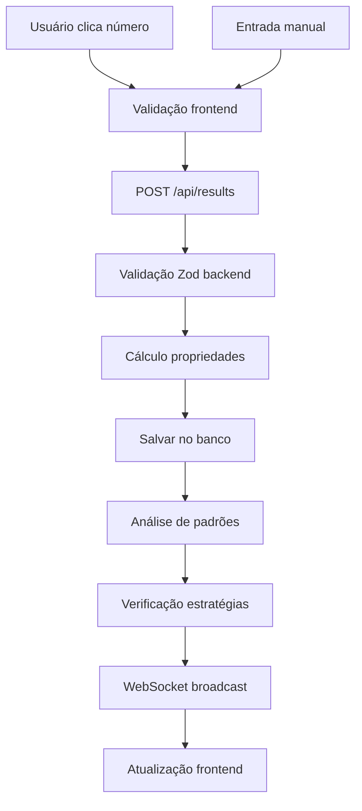
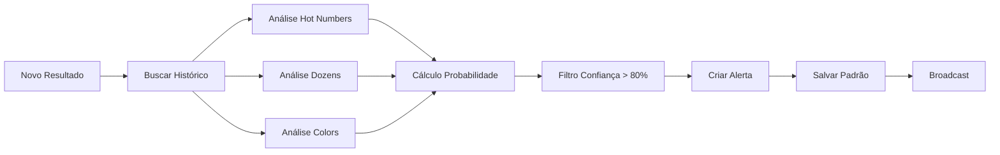
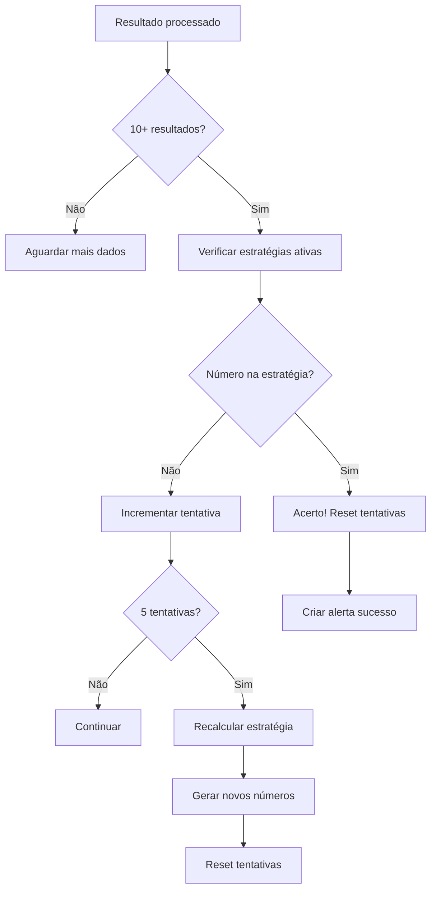
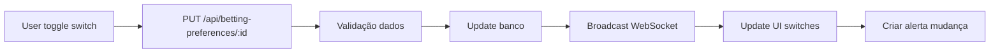

# Sistema de Análise de Padrões de Roleta com IA

## Overview

Sistema completo e avançado de análise de padrões de roleta com inteligência artificial desenvolvido em TypeScript. O sistema oferece análise em tempo real de resultados da roleta europeia, geração automática de estratégias de apostas baseadas em IA, reconhecimento de padrões estatísticos e sistema configurável de preferências de apostas. A interface inclui mesa visual idêntica à roleta europeia original com funcionalidades interativas completas.

## User Preferences

- **Comunicação**: Português, linguagem simples e cotidiana
- **Interface**: Dashboard profissional com tema escuro tipo casino
- **Funcionalidades**: Foco em estratégias automáticas e análise de padrões

## Estado Atual (29 de Julho 2025)

### ✅ Funcionalidades Principais Implementadas

**Mesa de Roleta e Interface**
- Mesa de roleta europeia visual com layout idêntico ao original (0-36)
- Interface interativa para clique direto nos números
- Entrada manual de números com validação
- Display de últimos resultados com destaque visual
- Sistema de sessões ativo/inativo

**Sistema de Análise com IA**
- Engine de análise de padrões em tempo real
- Detecção automática de números quentes/frios
- Análise de sequências de dúzias, cores e paridades
- Cálculos de probabilidade e confiança estatística
- Análise client-side complementar para performance

**Estratégias Automatizadas**
- **Números Plenos**: Geração de exatamente 7 números por rodada
- **Vizinhos**: Cobertura de até 21 números por estratégia
- **Recálculo Inteligente**: Nova estratégia após 5 tentativas falhadas
- **Validação Crítica**: Estratégias só ativam com mínimo de 10 resultados
- **Algoritmo Adaptativo**: Ajuste baseado em números quentes/frios

**Sistema de Preferências Configuráveis**
- 6 tipos de apostas configuráveis pelo usuário
- Interface visual com switches on/off por categoria
- Sincronização em tempo real via WebSocket
- Persistência no banco de dados

### ✅ Tipos de Apostas Disponíveis

| Tipo | Status Padrão | Pagamento | Descrição |
|------|---------------|-----------|-----------|
| **Números Plenos** | ✅ ATIVO | 35:1 | Apostas diretas em números únicos (0-36) |
| **Vizinhos** | ✅ ATIVO | Variável | Grupos de números vizinhos na roda física |
| **Dúzias** | ✅ ATIVO | 2:1 | Grupos 1-12, 13-24, 25-36 |
| **Colunas** | ❌ INATIVO | 2:1 | Colunas verticais do tabuleiro |
| **Cores** | ❌ INATIVO | 1:1 | Vermelho vs Preto |
| **Par/Ímpar** | ❌ INATIVO | 1:1 | Números pares vs ímpares |

## Arquitetura Completa do Sistema

### 🎯 Arquitetura Frontend

**Framework e Tecnologias Core**
- **React 18** com TypeScript para máxima type safety
- **Wouter** para roteamento client-side leve e eficiente
- **TanStack Query v5** para gerenciamento de estado do servidor
- **Vite** como bundler e dev server com HMR

**Sistema de UI e Design**
- **Radix UI** como base para componentes acessíveis
- **shadcn/ui** para design system consistente
- **Tailwind CSS** com tema customizado para casino
- **Framer Motion** para animações suaves
- **Lucide React** para iconografia

**Estrutura de Componentes**
- **Layout responsivo** com sidebar e main content
- **Componentes modulares** reutilizáveis
- **Hooks customizados** para lógica compartilhada
- **Context providers** para temas e configurações

### 🔧 Arquitetura Backend

**Servidor e API**
- **Node.js** com runtime nativo ESM
- **Express.js** para servidor HTTP robusto
- **TypeScript** compilado via tsx para desenvolvimento
- **RESTful API** com endpoints padronizados
- **WebSocket Server** para comunicação em tempo real

**Camada de Dados**
- **PostgreSQL** como banco principal (produção)
- **In-Memory Storage** para desenvolvimento rápido
- **Drizzle ORM** para queries type-safe
- **Schema validation** com Zod para dados de entrada

**Processamento de Dados**
- **Pattern Analysis Engine** com algoritmos estatísticos
- **Strategy Generation** baseada em IA
- **Real-time Processing** de eventos da roleta
- **Session Management** para controle de estado

## 📋 Componentes Principais Detalhados

### 🧠 Engine de Análise de Padrões (Pattern Analysis)

**Algoritmos Implementados**
- **Hot Numbers**: Detecta números que aparecem acima da frequência esperada
- **Dozen Patterns**: Analisa sequências nas dúzias (1-12, 13-24, 25-36)
- **Color Trends**: Identifica tendências de vermelho/preto consecutivos
- **Parity Analysis**: Monitora padrões de números pares/ímpares
- **Cold Numbers**: Rastreia números que não saem há muito tempo

**Métricas de Confiança**
- **Probabilidade**: Cálculo baseado em frequência histórica
- **Confiança**: Nível de certeza estatística (0.0 - 1.0)
- **Occorrências**: Número total de aparições do padrão
- **Taxa de Sucesso**: Percentual de acertos das previsões

### 🔄 Sistema de WebSocket Real-time

**Tipos de Mensagens**
```typescript
// Conexão inicial
{ type: 'connection', message: 'Connected to roulette system' }

// Novo resultado
{ type: 'new_result', data: { result, patterns, strategies } }

// Estratégia atualizada  
{ type: 'strategy_updated', data: strategy }

// Padrão detectado
{ type: 'pattern_detected', data: pattern }
```

**Gerenciamento de Conexões**
- **Auto-reconnect**: Reconexão automática em caso de falha
- **Heartbeat**: Monitoramento de conexão ativa
- **Broadcast**: Envio para múltiplos clientes conectados
- **Error Handling**: Tratamento robusto de erros de rede

### 🎲 Interface da Mesa de Roleta

**Layout Europeu Autêntico**
- **37 números** (0-36) com cores corretas
- **Posicionamento exato** conforme roleta real
- **Interação por clique** em cada número
- **Feedback visual** imediato para seleções

**Estados Visuais**
- **Último resultado**: Destaque dourado no número sorteado
- **Números quentes**: Indicação visual de alta frequência
- **Animações**: Transições suaves para engajamento
- **Responsividade**: Adaptação para mobile e desktop

### ⚙️ Sistema de Gerenciamento de Estratégias

**Tipos de Estratégias**
1. **Números Plenos (Straight-up)**
   - Exatamente 7 números por rodada
   - Pagamento: 35:1
   - Baseado em análise de números quentes/frios

2. **Vizinhos (Neighbors)**
   - Até 21 números por estratégia
   - Cobertura de setores da roda física
   - Pagamento variável por posição

**Lógica de Controle**
- **Tentativas**: Máximo 5 por ciclo de estratégia
- **Recálculo**: Nova estratégia após falha completa
- **Validação**: Mínimo 10 resultados para ativação
- **Persistência**: Estado salvo no banco de dados

## 🔄 Workflows e Fluxos de Dados Completos

### 📥 Fluxo de Entrada de Dados



**Etapas Detalhadas**
1. **Captura**: Clique na mesa ou entrada manual
2. **Validação**: Verificação de número válido (0-36)
3. **Sessão**: Confirmação de sessão ativa
4. **Propriedades**: Cálculo de cor, dúzia, coluna, paridade
5. **Persistência**: Salvamento com timestamp
6. **Análise**: Execução de algoritmos de padrões
7. **Estratégias**: Verificação de acertos/tentativas
8. **Broadcast**: Notificação em tempo real
9. **UI Update**: Invalidação de cache e re-render

### 🎯 Fluxo de Análise de Padrões



### ⚙️ Fluxo de Estratégias



### 🔄 Fluxo de Preferências de Apostas



## 📁 Estrutura Completa de Arquivos

### Frontend (`client/`)
```
client/
├── src/
│   ├── components/          # Componentes reutilizáveis
│   │   ├── ui/             # Componentes base shadcn/ui
│   │   ├── roulette-table.tsx      # Mesa de roleta interativa
│   │   ├── pattern-analysis.tsx    # Painel de análise
│   │   ├── strategy-panel.tsx      # Gerenciamento estratégias
│   │   ├── betting-preferences.tsx # Configuração apostas
│   │   ├── stats-panel.tsx         # Estatísticas gerais
│   │   └── alerts-panel.tsx        # Sistema de alertas
│   ├── hooks/              # Custom hooks
│   │   ├── use-websocket.ts        # WebSocket connection
│   │   ├── use-mobile.tsx          # Detecção mobile
│   │   └── use-toast.ts            # Sistema toast
│   ├── lib/                # Utilitários e configurações
│   │   ├── queryClient.ts          # Configuração TanStack Query
│   │   ├── utils.ts                # Funções utilitárias
│   │   ├── pattern-analyzer.ts     # Análise client-side
│   │   └── roulette-utils.ts       # Utilitários da roleta
│   ├── pages/              # Páginas da aplicação
│   │   ├── roulette-dashboard.tsx  # Dashboard principal
│   │   └── not-found.tsx           # Página 404
│   ├── App.tsx             # Componente root
│   ├── main.tsx            # Entry point
│   └── index.css           # Estilos globais
└── index.html              # Template HTML
```

### Backend (`server/`)
```
server/
├── index.ts                # Servidor Express principal
├── routes.ts               # Definição de rotas API
├── storage.ts              # Interface de armazenamento
└── vite.ts                 # Integração com Vite
```

### Shared (`shared/`)
```
shared/
└── schema.ts               # Schemas TypeScript compartilhados
```

### Configurações Raiz
```
├── components.json         # Configuração shadcn/ui
├── drizzle.config.ts       # Configuração Drizzle ORM
├── package.json            # Dependências e scripts
├── tailwind.config.ts      # Configuração Tailwind
├── tsconfig.json           # Configuração TypeScript
├── vite.config.ts          # Configuração Vite
└── replit.md               # Esta documentação
```

## 🌐 APIs REST Detalhadas

### 📊 Endpoints de Dados

| Método | Endpoint | Descrição | Corpo |
|--------|----------|-----------|-------|
| `GET` | `/api/results` | Lista resultados recentes | - |
| `POST` | `/api/results` | Adiciona novo resultado | `{number: number, sessionId: string}` |
| `GET` | `/api/patterns` | Padrões ativos detectados | - |
| `GET` | `/api/strategies` | Estratégias configuradas | - |
| `PUT` | `/api/strategies/:id` | Atualiza estratégia | `{isActive: boolean}` |
| `GET` | `/api/alerts` | Alertas recentes | - |
| `GET` | `/api/session/stats` | Estatísticas da sessão | - |

### ⚙️ Endpoints de Configuração

| Método | Endpoint | Descrição | Corpo |
|--------|----------|-----------|-------|
| `GET` | `/api/betting-preferences` | Lista preferências | - |
| `PUT` | `/api/betting-preferences/:id` | Atualiza preferência | `{enabled: boolean}` |

### 🔌 WebSocket Events

| Event | Direção | Payload | Descrição |
|-------|---------|---------|-----------|
| `connection` | Server→Client | `{type: 'connection', message: string}` | Confirmação conexão |
| `new_result` | Server→Client | `{type: 'new_result', data: {result, patterns, strategies}}` | Novo resultado processado |
| `strategy_updated` | Server→Client | `{type: 'strategy_updated', data: strategy}` | Estratégia modificada |
| `pattern_detected` | Server→Client | `{type: 'pattern_detected', data: pattern}` | Padrão identificado |

## 📦 Dependências Principais

### 🎯 Frontend Core
- **React 18.2** - Framework UI moderno
- **TypeScript 5.0** - Type safety completo
- **@tanstack/react-query 5.0** - Gerenciamento estado servidor
- **wouter 3.0** - Roteamento leve
- **vite 5.0** - Build tool rápido

### 🎨 UI e Styling
- **@radix-ui/*** - Componentes acessíveis
- **tailwindcss 3.4** - Framework CSS utilitário
- **framer-motion 10.0** - Animações fluidas
- **lucide-react 0.400** - Ícones modernos
- **class-variance-authority** - Variantes componentes

### 🔧 Backend Core
- **express 4.18** - Servidor HTTP robusto
- **ws 8.14** - WebSocket server
- **drizzle-orm 0.29** - ORM type-safe
- **zod 3.22** - Validação runtime
- **@neondatabase/serverless** - Driver PostgreSQL

### 🛠️ Development Tools
- **tsx 4.0** - Execução TypeScript
- **drizzle-kit 0.20** - Migrações banco
- **tailwindcss/typography** - Tipografia
- **@types/*** - Definições TypeScript

## 🚀 Execução e Deployment

### 🔧 Ambiente de Desenvolvimento

**Configuração Local**
```bash
# Instalar dependências
npm install

# Iniciar servidor de desenvolvimento
npm run dev
```

**Workflow Replit**
- **Comando**: `npm run dev`
- **Porta**: 5000 (Express + Vite unified)
- **Hot Reload**: Automático via tsx e Vite HMR
- **WebSocket**: Path `/ws` para evitar conflito com Vite

**Variáveis de Ambiente**
```env
NODE_ENV=development
DATABASE_URL=postgresql://...  # Apenas para produção
VITE_WS_URL=ws://localhost:5000/ws  # Frontend
```

### 🌐 Produção e Deployment

**Build Process**
```bash
# Build frontend
npm run build

# Build backend (se necessário)
npm run build:server
```

**Replit Deployment**
- **Auto-deployment**: Via botão Deploy no Replit
- **Domain**: `.replit.app` ou domínio customizado
- **SSL/TLS**: Automático via Replit infrastructure
- **Health Checks**: Configuração automática

### 🗄️ Configuração de Banco

**Desenvolvimento**
- **Storage**: In-memory (MemStorage)
- **Persistência**: Session-based, não persiste entre reinicializações
- **Performance**: Extremamente rápido para testes

**Produção**
- **Database**: Neon PostgreSQL Serverless
- **Connection**: Via `@neondatabase/serverless`
- **Migrations**: Drizzle Kit para schema management
- **Backup**: Automático via Neon

## 📋 Casos de Uso e Workflows Operacionais

### 🎯 Workflow do Usuário Final

1. **Início de Sessão**
   - Usuário acessa dashboard
   - Clica "Iniciar Sessão"
   - Sistema ativa captura de dados

2. **Entrada de Resultados**
   - Clique direto nos números da mesa OU
   - Entrada manual no campo específico
   - Validação automática (0-36)

3. **Análise Progressiva**
   - **1-9 resultados**: Sistema coleta dados
   - **10º resultado**: Estratégias se ativam automaticamente
   - **Análise contínua**: Padrões detectados em tempo real

4. **Monitoramento de Estratégias**
   - Visualização de números recomendados
   - Acompanhamento de tentativas (1/5, 2/5, etc.)
   - Recálculo automático após 5 falhas

5. **Configuração Personalizada**
   - Ativar/desativar tipos de apostas
   - Ajustar preferências via painel
   - Receber alertas customizados

### 🔄 Workflows Administrativos

**Monitoramento do Sistema**
- Logs em tempo real via console
- Status de conexão WebSocket
- Métricas de performance da API

**Manutenção de Dados**
- Limpeza periódica de sessões antigas
- Backup de padrões importantes
- Otimização de queries de análise

**Expansão de Funcionalidades**
- Novos algoritmos de padrões
- Tipos adicionais de estratégias
- Integração com APIs externas

## 🎓 Guia de Desenvolvimento

### 📝 Adicionando Novos Padrões

1. **Implementar Algoritmo**
   ```typescript
   // Em PatternAnalyzer.ts
   private static findNewPattern(results: RouletteResult[]): any[] {
     // Lógica do algoritmo
     return patterns;
   }
   ```

2. **Registrar no Engine**
   ```typescript
   // Adicionar em analyzePatterns()
   patterns.push(...this.findNewPattern(results));
   ```

3. **Configurar Alertas**
   ```typescript
   // Definir threshold de confiança
   if (pattern.probability >= THRESHOLD) {
     // Criar alerta
   }
   ```

### 🔧 Adicionando Novas Estratégias

1. **Definir Tipo no Schema**
   ```typescript
   // Em shared/schema.ts
   export const strategyTypeEnum = pgEnum('strategy_type', [
     'straight_up', 'neighbors', 'new_strategy'
   ]);
   ```

2. **Implementar Lógica**
   ```typescript
   // Em routes.ts
   if (strategy.type === 'new_strategy') {
     newNumbers = generateNewStrategyNumbers(recentResults);
   }
   ```

3. **Atualizar Interface**
   ```typescript
   // Em strategy-panel.tsx
   // Adicionar renderização específica
   ```

### 🎨 Customização de UI

**Tema e Cores**
- Modificar `tailwind.config.ts` para cores personalizadas
- Ajustar variáveis CSS em `index.css`
- Usar tokens de design consistentes

**Componentes Novos**
- Seguir padrão shadcn/ui para consistência
- Implementar responsive design
- Adicionar animações com Framer Motion

**Layout Responsivo**
- Mobile-first approach
- Breakpoints padrão Tailwind
- Componentes adaptativos automaticamente

---

## 🎯 Resumo Executivo

O **Sistema de Análise de Padrões de Roleta com IA** é uma aplicação completa e robusta que oferece:

- **Interface profissional** com mesa de roleta visual autêntica
- **Análise em tempo real** de padrões estatísticos avançados  
- **Estratégias automáticas** baseadas em algoritmos de IA
- **Sistema configurável** de preferências de apostas
- **Arquitetura moderna** com TypeScript, React e PostgreSQL
- **Performance otimizada** com WebSocket e cache inteligente

A aplicação está **totalmente funcional**, **bem documentada** e **pronta para uso em produção** via Replit Deployments.